# 03_流程图

> **版本**：v7.0
> **生成时间**：2026-04-27
> **依赖文档**：00_业务需求.md、01_干系人与角色.md
> **本次补充**：新增地址簿管理流程、地址簿选择流程

---

## 流程分析

本系统包含以下核心业务流程：

| 序号 | 流程名称 | 流程类型 | 说明 |
|:----:|:---------|:---------|:-----|
| 1 | 店铺用户账号注册流程 | 简单流程 | 店铺用户提交注册，管理员审核 |
| 2 | 店铺申请流程 | 简单流程 | 店铺用户申请店铺，管理员审核 |
| 3 | 普通用户创建流程 | 简单流程 | 店铺用户生成邀请码或直接创建普通用户 |
| 4 | 商品兑换流程 | 简单流程 | 普通用户浏览并兑换商品 |
| 5 | 订单处理流程 | 简单流程 | 店铺用户确认订单、发货、确认完成 |
| 6 | 订单关闭流程 | 简单流程 | 用户或店铺用户关闭订单 |
| 7 | 积分维护流程 | CRUD流程 | 店铺用户增加/扣除普通用户积分 |
| 8 | 商品管理流程 | CRUD流程 | 店铺用户对商品进行增删改查 |
| 9 | 密码重置流程 | 简单流程 | 管理员或店铺用户重置用户密码 |
| 10 | 地址簿管理流程 | CRUD流程 | 普通用户新增/编辑/删除/设默认地址 |
| 11 | 地址簿选择流程 | 简单流程 | 实物兑换时从地址簿选择或手动输入地址 |

---

### 流程1：店铺用户账号注册流程

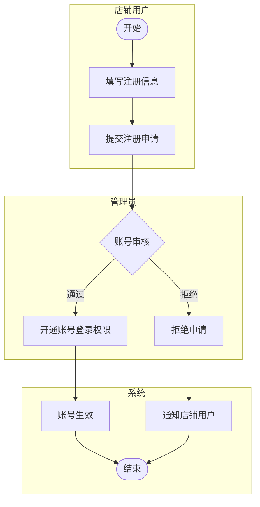

**说明**：店铺用户注册账号后，需要管理员审核通过后才能登录。审核拒绝后店铺用户可重新填写理由再次申请。

---

### 流程2：店铺申请流程

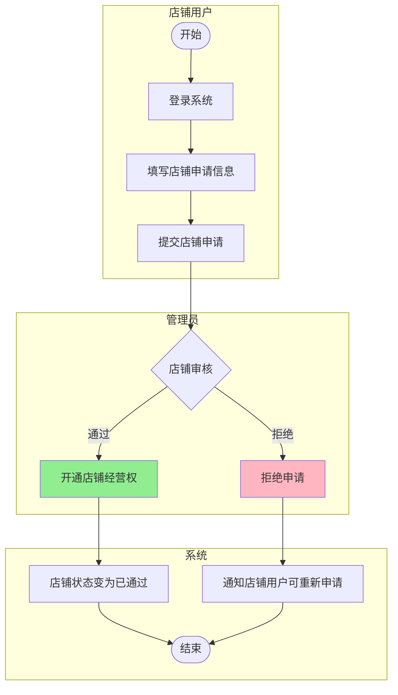

**说明**：
- 店铺申请通过后，店铺状态变为「已通过」，店铺用户可正常上架商品
- 店铺申请被拒绝后，店铺用户可重新填写理由再次申请
- 店铺冻结后，店铺用户需重新申请

---

### 流程3：普通用户创建流程

#### 3.1 邀请码注册方式

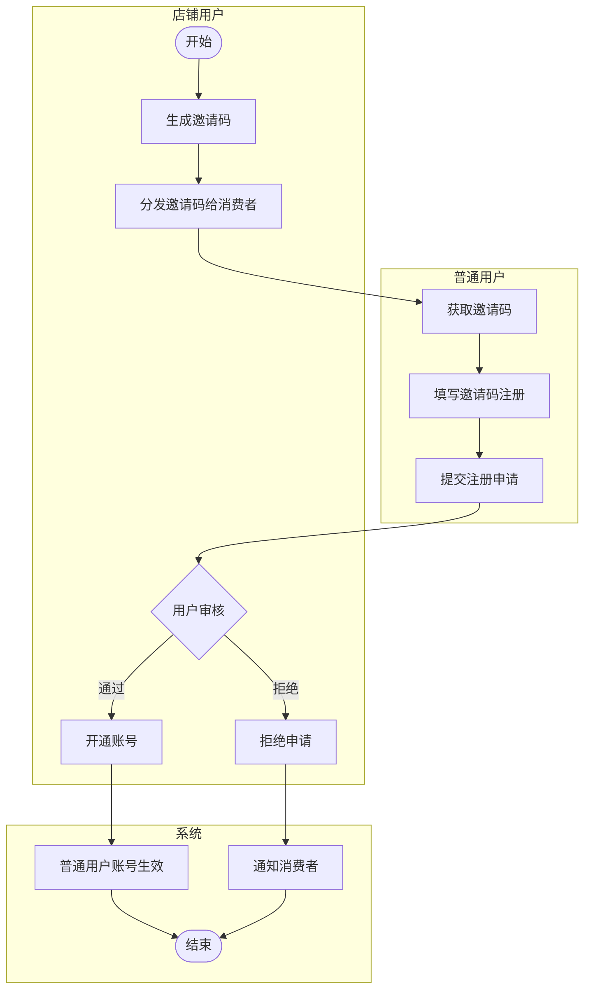

#### 3.2 直接创建方式

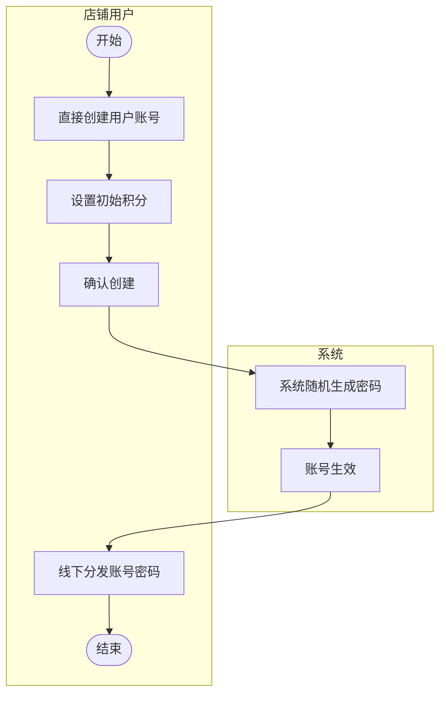

**说明**：
- 邀请码注册方式：消费者通过邀请码注册后，需要店铺用户审核通过
- 直接创建方式：店铺用户批量创建账号，系统随机生成密码，线下分发

---

### 流程4：商品兑换流程

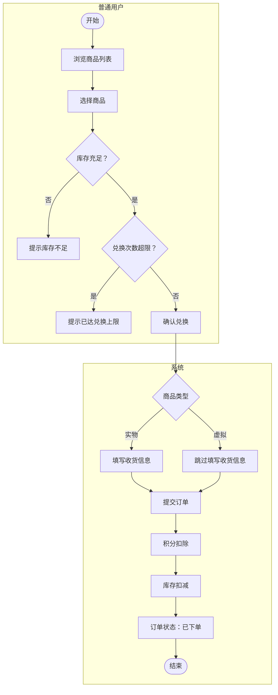

**说明**：
- 商品兑换时检查：库存是否充足、用户兑换次数是否超限
- 实物商品需要填写收货信息（收货人姓名、手机号码、收货地址）
- 虚拟商品（电子券、点卡等）无需填写收货信息

---

### 流程5：订单处理流程

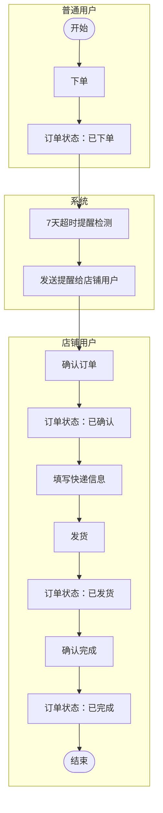

**说明**：
- 订单「已下单」状态超过7天未确认，系统发送超时提醒
- 店铺用户发货时需要填写快递类型和快递单号
- 订单完成后状态变为「已完成」

---

### 流程6：订单关闭流程

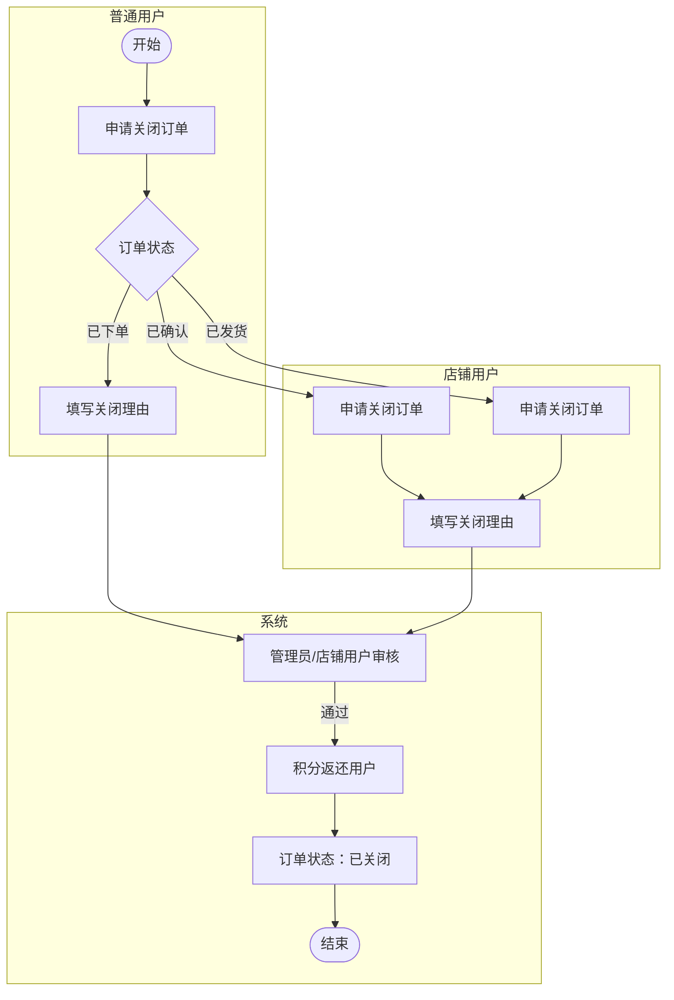

**说明**：
- 已下单订单：普通用户可申请关闭，店铺用户可申请关闭
- 已确认/已发货订单：仅店铺用户可申请关闭
- 关闭订单必须填写理由（如：用户取消、商家缺货、其他）
- 关闭订单后积分返还用户

---

### 流程7：积分维护流程

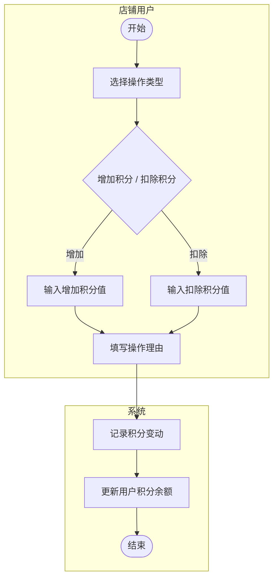

**说明**：
- 店铺用户可以增加或扣除普通用户积分
- 增加和扣除操作都需要填写操作理由
- 操作记录用于积分变动的可追溯

---

### 流程8：商品管理流程

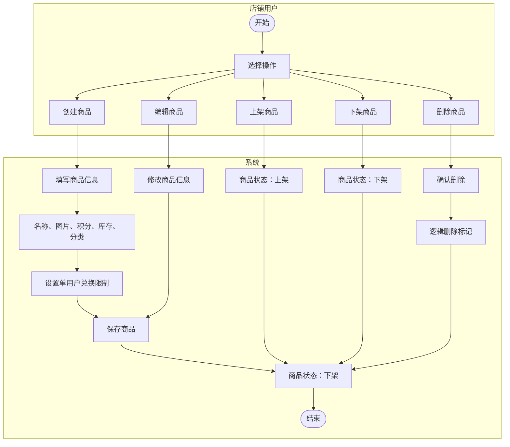

**说明**：
- 创建商品时填写：名称、图片、积分价格、库存、商品基本信息（分类选择系统内置或商家自定义）、描述、单用户最大兑换个数
- 新创建商品默认为下架状态，需要手动上架
- 商品删除为逻辑删除，不是物理删除

---

### 流程9：密码重置流程

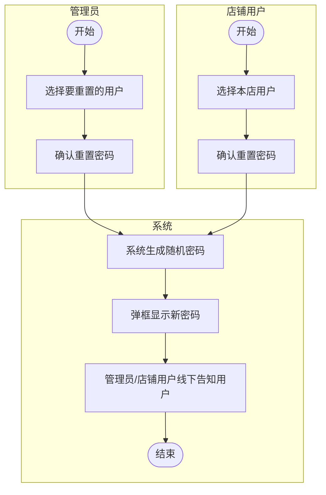

**说明**：
- 管理员可以重置任何用户（店铺用户、普通用户）的密码
- 店铺用户只能重置本店普通用户的密码
- 新密码由系统随机生成，通过弹框显示，由管理员线下告知用户

---

### 流程10：地址簿管理流程

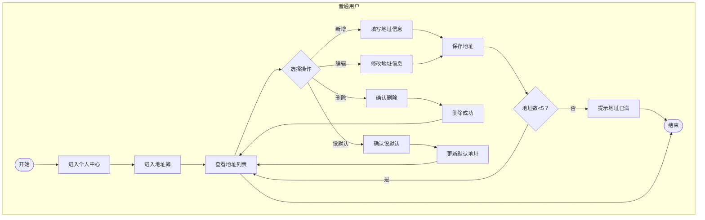

**说明**：
- 普通用户最多管理5个收货地址
- 新增/编辑地址时需填写：收货人姓名、手机号码、收货地址
- 删除地址无限制（默认地址也可删除）
- 设置默认地址后，下单时自动带入该地址

---

### 流程11：地址簿选择流程（实物兑换场景）

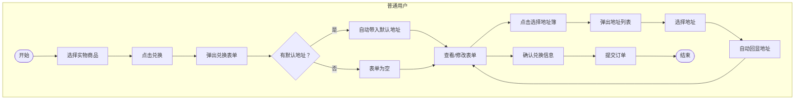

**说明**：
- 实物商品兑换时，表单自动带入默认地址（若有）
- 用户可点击「选择地址簿」按钮，二次弹框从地址列表中选择
- 选择后地址自动回显到表单
- 用户也可手动修改表单中的地址信息