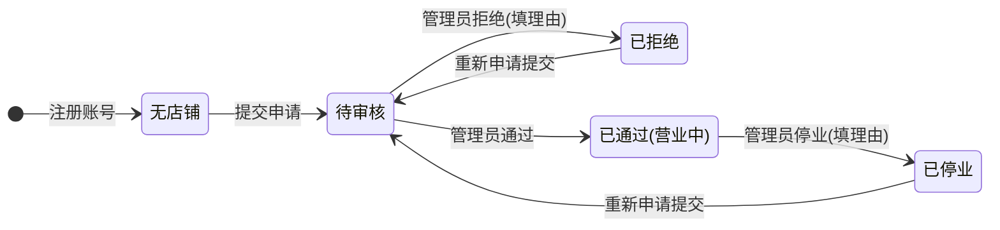

# 店铺管理 功能需求规格说明书

## 文档信息

- 基线 Feature：无
- 变更组：无

---

# 功能需求规格说明书

## 1. 概述

### 1.1 功能背景

店铺管理是多店铺积分商城系统的核心功能之一，用于管理店铺的入驻申请和日常运营状态。店铺用户在平台注册账号后，需要提交店铺申请，经过管理员审核通过后才能正式营业。管理员有权对店铺进行停业处理，店铺需重新审核才能恢复营业。

### 1.2 本功能业务目标

1. 实现店铺入驻申请的提交、审核、拒绝、重新申请全流程管理
2. 管理员可对店铺进行停业操作，停业后商品自动下架
3. 店铺状态变更通过站内消息及时通知店铺用户
4. 确保店铺运营状态的规范流转和数据隔离

---

## 2. 角色与权限矩阵

> **说明**：本章节整合所有权限信息，是权限控制的**单一真实来源**。第4章各页面的权限要求均引用本章节，避免重复定义。

### 2.1 数据权限（行级访问控制）

> 定义不同角色针对**本功能数据**的行级别访问权限（即"谁能看到哪些数据行"）。

| 角色 | 数据范围 | 说明 |
|------|---------|------|
| 管理员 | 全部店铺数据 | 可查看和操作所有店铺的申请记录和状态 |
| 店铺用户 | 仅本店数据 | 只能查看和管理自己店铺的申请和状态 |

**数据范围说明：**
- **管理员**：无过滤条件，可访问所有店铺数据
- **店铺用户**：只能访问 `shop.user_id = 当前用户ID` 的店铺数据

### 2.2 页面访问权限

> 定义不同角色对各页面的访问和操作权限。

| 页面名称 | 可访问角色 | 可操作角色 | 字段级权限（如有） |
|---------|----------|----------|------------------|
| 店铺管理（管理员端） | 管理员 | 管理员 | 无特殊限制 |
| 我的店铺（店铺用户端） | 店铺用户 | 店铺用户 | 无特殊限制 |

**权限说明：**
- **可访问角色**：能够进入该页面/弹窗的角色
- **可操作角色**：能够执行主要操作（新建、编辑、删除等）的角色
- **字段级权限**：如存在字段级别的差异化权限，在此说明

---

## 3. 页面与功能总览

### 3.1 页面清单

| 序号 | 页面名称 | 页面形式 | 职责说明 | 包含功能 |
|-----|---------|---------|---------|---------|
| 1 | 店铺管理 | 独立页面（管理员端） | 查看所有店铺申请列表，对申请进行审核和停业操作 | 店铺申请列表、审核操作、停业操作 |
| 2 | 我的店铺 | 独立页面（店铺用户端） | 提交店铺申请、查看本店状态、被拒绝后可修改重新申请 | 店铺申请表单、店铺状态展示、重新申请 |

### 3.2 页面跳转流程

```
[管理员菜单] → 店铺管理（店铺列表）
                    ↓
              点击「查看详情」→ 店铺详情弹窗
                    ↓
              点击「通过」/「拒绝」/「停业」→ 操作后列表刷新

[店铺用户菜单] → 我的店铺
                    ↓
              有店铺：显示店铺信息卡片（状态+操作入口）
                    ↓
              无店铺：显示「暂无店铺，立即申请」→ 点击 → 申请表单
                    ↓
              有店铺且被拒绝：显示拒绝理由 + 「重新申请」按钮 → 点击 → 申请表单（预填原数据）
```

**流程说明：**
1. 管理员从店铺管理列表可查看所有店铺的申请状态
2. 管理员可对"待审核"状态的申请进行通过/拒绝操作
3. 管理员可对"已通过（营业中）"状态的店铺进行停业操作
4. 店铺用户在我的店铺页面可提交申请或查看本店状态
5. 被拒绝后，店铺用户可修改信息并重新提交

---

## 4. 页面功能详细说明

### 按钮级别说明（通用）

> 本小节定义按钮级别的通用概念，各页面具体按钮在"功能与按钮"小节描述。

| 级别 | 位置 | 作用域 | 示例 |
|-----|-----|-------|------|
| **页面级按钮** | 页面顶部工具栏 | 针对整个页面或全局操作 | 新增、批量操作、导出、刷新 |
| **行级按钮** | 列表/表格的每行操作列 | 针对单条数据记录 | 查看详情、通过、拒绝、停业 |
| **字段级按钮** | 字段右侧或内部 | 针对单个字段的辅助操作 | 上传图片、清除 |

---

### 4.1 页面 1：店铺管理（管理员端）

#### 4.1.1 页面概述

**页面形式：**参见第3.1节页面清单

**页面职责：**管理员查看所有店铺申请列表，对待审核的申请进行通过/拒绝操作，对营业中的店铺进行停业操作。

#### 4.1.2 涉及字段

##### A. 查询字段（列表页专用）

> 搜索条件区域使用的字段，用于数据筛选和查询

| 字段名称 | 字段类型 | 数据来源 | 校验规则 | 默认值 | 业务含义 |
|---------|---------|---------|---------|--------|--------|
| 关键词搜索 | 文本 | 用户输入 | 支持模糊匹配店铺名称 | 空 | 按店铺名称模糊搜索 |
| 状态筛选 | 下拉选择 | 系统预设 | 枚举：全部/待审核/已通过/已拒绝/已停业 | 全部 | 按店铺状态筛选 |

##### B. 显示字段

> 列表表格中显示的字段

| 字段名称 | 字段类型 | 数据来源 | 获取时机 | 校验规则 | 默认值 | 业务含义 |
|---------|---------|---------|---------|---------|--------|--------|
| 店铺名称 | 文本 | 数据库查询 | 页面加载 | 必填，≤20字 | - | 店铺的显示名称 |
| 店铺Logo | 图片 | 数据库查询 | 页面加载 | 选传，支持jpg/png | - | 店铺标识图片 |
| 店铺简介 | 文本 | 数据库查询 | 页面加载 | ≤200字 | - | 店铺简短介绍 |
| 店铺状态 | 字典值 | 数据库查询 | 页面加载 | 枚举：待审核/已拒绝/已通过/已停业 | - | 当前审核状态 |
| 拒绝理由 | 文本 | 数据库查询 | 页面加载 | 当状态为已拒绝时显示 | - | 管理员填写的拒绝原因 |
| 停业理由 | 文本 | 数据库查询 | 页面加载 | 当状态为已停业时显示 | - | 管理员填写的停业原因 |
| 申请时间 | 日期时间 | 数据库查询 | 页面加载 | - | - | 店铺提交申请的时间 |
| 操作时间 | 日期时间 | 数据库查询 | 页面加载 | - | - | 最后一次审核/停业操作的时间 |

#### 4.1.3 功能与按钮

> **填写指引**：
> 1. 功能说明只写该按钮的直接行为（打开什么、触发什么）和绑定约束（二次确认、倒计时）。涉及多个按钮/跨字段的规则放在 4.1.4 业务规则，不要在此重复。
> 2. **跨页面功能归属原则**：当一个功能在页面A触发但核心行为在页面B完成时（如页面A有"新建"按钮，实际操作在页面B的弹框中执行），仅在页面B的「功能与按钮」中完整定义该功能，页面A仅保留触发入口说明（一句话描述"点击后打开页面B的XX功能"），页面A不重复定义按钮级别、权限、加载状态等信息。

**用户可操作功能：**

- **查看详情**
  - 触发按钮：列表行点击
  - 按钮级别：行级
  - 按钮位置：列表行任意位置
  - 触发方式：点击列表行
  - 权限要求：仅管理员
  - 加载状态：无
  - 功能说明：点击后弹出店铺详情弹窗，展示店铺名称、Logo、简介、状态、申请时间、操作时间、拒绝/停业理由（如有）

- **通过申请**
  - 触发按钮：通过
  - 按钮级别：行级
  - 按钮位置：列表操作列
  - 触发方式：点击按钮
  - 权限要求：仅管理员，且仅对"待审核"状态店铺显示
  - 加载状态：点击后显示loading，禁止重复点击
  - 功能说明：点击后店铺状态变更为"已通过（营业中）"，发送站内消息通知店铺用户

- **拒绝申请**
  - 触发按钮：拒绝
  - 按钮级别：行级
  - 按钮位置：列表操作列
  - 触发方式：点击按钮
  - 权限要求：仅管理员，且仅对"待审核"状态店铺显示
  - 加载状态：点击后显示loading
  - 功能说明：点击后弹出拒绝理由填写弹窗（必填理由），提交后店铺状态变更为"已拒绝"，发送站内消息通知店铺用户

- **停业操作**
  - 触发按钮：停业
  - 按钮级别：行级
  - 按钮位置：列表操作列
  - 触发方式：点击按钮
  - 权限要求：仅管理员，且仅对"已通过（营业中）"状态店铺显示
  - 加载状态：点击后显示loading
  - 功能说明：点击后弹出停业理由填写弹窗（必填理由），提交后店铺状态变更为"已停业"，自动下架该店铺所有商品，发送站内消息通知店铺用户

**后台自动流程（如有）：**

- **商品自动下架**
  - 触发时机：管理员对店铺执行停业操作并填写理由后
  - 说明：店铺状态变更为"已停业"后，系统自动将该店铺的所有上架商品状态变更为"已下架"，已流转的订单（已确认/已发货/已完成）不受影响

#### 4.1.4 业务规则

> **填写指引**：本节只放跨按钮、跨页面、跨字段的约束和条件逻辑。已在 4.1.3 功能与按钮、4.1.2 涉及字段、4.1.6 权限要求中描述过的内容不要重复。无额外规则时标注「无额外业务规则」。

- **规则1：停业后商品自动下架**
  - 规则描述：管理员对店铺执行停业操作后，该店铺所有状态为"上架"的商品自动变更为"下架"状态
  - 触发条件：店铺状态变更为"已停业"
  - 约束说明：已流转的订单（已确认/已发货/已完成）状态和商品不受影响

- **规则2：审核结果站内消息通知**
  - 规则描述：店铺状态变更（通过/拒绝/停业）后，系统自动发送站内消息通知店铺用户
  - 触发条件：店铺状态发生变更
  - 约束说明：消息内容包含操作类型、理由（如有）、操作时间

#### 4.1.5 交互逻辑

> **填写指引**：本节只写**纯UI层面的交互细节**（如空状态提示、加载动画、列表排序方式、弹框打开/关闭行为、悬停效果等）。已在 4.1.3 功能与按钮（按钮行为）、4.1.4 业务规则（业务约束）、4.1.2 涉及字段（字段校验）、第5章（后端流程）中描述过的内容不要在此重复。如果本节无纯UI层面的交互细节需要补充，标注「无额外交互逻辑」。

- 列表默认按申请时间倒序排列，最新申请在前
- 状态筛选默认为"全部"，显示所有状态的店铺
- 空状态：无申请记录时显示"暂无店铺申请数据"

#### 4.1.6 权限要求

> **参见第2.2节"页面访问权限"**，本页面的可访问角色、可操作角色、字段级权限均以第2章定义为准。

---

### 4.2 页面 2：我的店铺（店铺用户端）

#### 4.2.1 页面概述

**页面形式：**参见第3.1节页面清单

**页面职责：**店铺用户提交店铺申请、查看本店审核状态、被拒绝后可修改信息重新申请。

#### 4.2.2 涉及字段

**申请表单字段：**

| 字段名称 | 字段类型 | 数据来源 | 获取时机 | 校验规则 | 默认值 | 业务含义 |
|---------|---------|---------|---------|---------|--------|--------|
| 店铺名称 | 文本 | 用户输入 | 实时输入 | 必填，≤20字 | - | 店铺的显示名称 |
| 店铺Logo | 文件上传 | 用户上传 | 实时上传 | 选传，支持jpg/png格式 | - | 店铺标识图片 |
| 店铺简介 | 文本 | 用户输入 | 实时输入 | ≤200字 | - | 店铺简短介绍 |

**店铺信息卡片显示字段：**

| 字段名称 | 字段类型 | 数据来源 | 获取时机 | 校验规则 | 默认值 | 业务含义 |
|---------|---------|---------|---------|---------|--------|--------|
| 店铺名称 | 文本 | 数据库查询 | 页面加载 | - | - | 已申请的店铺名称 |
| 店铺Logo | 图片 | 数据库查询 | 页面加载 | - | - | 已申请的店铺Logo |
| 店铺简介 | 文本 | 数据库查询 | 页面加载 | - | - | 已申请的店铺简介 |
| 店铺状态 | 字典值 | 数据库查询 | 页面加载 | 枚举：待审核/已拒绝/已通过/已停业 | - | 当前审核状态 |
| 拒绝理由 | 文本 | 数据库查询 | 页面加载 | 当状态为已拒绝时显示 | - | 管理员填写的拒绝原因 |
| 停业理由 | 文本 | 数据库查询 | 页面加载 | 当状态为已停业时显示 | - | 管理员填写的停业原因 |
| 申请时间 | 日期时间 | 数据库查询 | 页面加载 | - | - | 最近一次申请提交的时间 |
| 操作时间 | 日期时间 | 数据库查询 | 页面加载 | - | - | 最后一次审核/停业操作的时间 |

#### 4.2.3 功能与按钮

> **填写指引**：
> 1. 功能说明只写该按钮的直接行为（打开什么、触发什么）和绑定约束（二次确认、倒计时）。涉及多个按钮/跨字段的规则放在 4.2.4 业务规则，不要在此重复。
> 2. **跨页面功能归属原则**：参见4.1.3的跨页面功能归属原则。

**用户可操作功能：**

- **立即申请**
  - 触发按钮：立即申请
  - 按钮级别：页面级
  - 按钮位置：页面主体区域（当无店铺时显示）
  - 触发方式：点击按钮
  - 权限要求：仅店铺用户，且当前无店铺关联
  - 加载状态：点击后进入申请表单页面
  - 功能说明：点击后进入店铺申请表单页面，填写店铺信息后提交

- **重新申请**
  - 触发按钮：重新申请
  - 按钮级别：页面级
  - 按钮位置：店铺信息卡片底部操作区（当状态为已拒绝或已停业时显示）
  - 触发方式：点击按钮
  - 权限要求：仅店铺用户，且店铺状态为已拒绝或已停业
  - 加载状态：点击后进入申请表单页面
  - 功能说明：点击后进入店铺申请表单页面，预填原有店铺信息，用户可修改后重新提交，提交后状态变更为"待审核"

- **提交申请**
  - 触发按钮：提交申请
  - 按钮级别：页面级
  - 按钮位置：申请表单底部
  - 触发方式：点击按钮
  - 权限要求：仅店铺用户
  - 加载状态：点击后显示loading，禁止重复提交
  - 功能说明：点击后验证表单必填项，验证通过后提交申请，店铺状态变更为"待审核"，等待管理员审核

- **上传店铺Logo**
  - 触发按钮：上传按钮/Logo区域点击
  - 按钮级别：字段级
  - 按钮位置：表单Logo字段右侧
  - 触发方式：点击上传
  - 权限要求：仅店铺用户
  - 加载状态：上传中显示loading
  - 功能说明：点击后打开文件选择器，支持jpg/png格式图片上传

**后台自动流程（如有）：**

> **填写指引**：参见4.1.3的「后台自动流程」填写指引。如无前端自动流程，删除本小节。

无

#### 4.2.4 业务规则

> **填写指引**：本节只放跨按钮、跨页面、跨字段的约束和条件逻辑。已在 4.2.3 功能与按钮、4.2.2 涉及字段、4.2.6 权限要求中描述过的内容不要重复。无额外规则时标注「无额外业务规则」。

- **规则1：店铺状态与功能可用性**
  - 规则描述：不同店铺状态下，用户可进行的操作不同
  - 触发条件：根据店铺当前状态判断
  - 约束说明：
    - 无店铺：仅显示"立即申请"按钮
    - 待审核：仅显示店铺信息卡片，无操作按钮
    - 已通过（营业中）：显示店铺信息卡片，无操作按钮
    - 已拒绝：显示店铺信息卡片（带拒绝理由）+ "重新申请"按钮
    - 已停业：显示店铺信息卡片（带停业理由）+ "重新申请"按钮

- **规则2：重新申请直接变更状态**
  - 规则描述：店铺用户点击"重新申请"并提交后，店铺状态直接从"已拒绝"或"已停业"变更为"待审核"，无需管理员确认
  - 触发条件：店铺用户重新提交申请表单
  - 约束说明：每次重新申请都会创建新的申请记录

#### 4.2.5 交互逻辑

> **填写指引**：参见4.1.5的交互逻辑填写指引。如无额外交互逻辑，标注「无额外交互逻辑」。

- 页面加载时根据店铺用户是否有店铺关联显示不同内容
- 无店铺：显示空状态引导区域，文字提示"您还没有申请店铺，立即申请入驻"，下方显示"立即申请"按钮
- 有店铺：显示店铺信息卡片
- 被拒绝/停业：店铺信息卡片内显示管理员填写的理由，下方显示"重新申请"按钮
- 申请提交后显示提交成功提示，3秒后自动跳转回店铺信息页面

#### 4.2.6 权限要求

> **参见第2.2节"页面访问权限"**，本页面的可访问角色、可操作角色、字段级权限均以第2章定义为准。

**本页面特殊权限说明（如有）：**
- 仅店铺用户可访问，管理员不可访问此页面

---

## 5. 非页面功能详细说明

> 本章描述无需用户界面触发的功能，如定时任务、API服务、数据同步等。

> **判断标准**：
> - ✅ 必须填写：如果功能包含任何后台自动执行的任务（定时任务、消息队列消费、第三方回调等）
> - ✅ 必须填写：如果功能提供API接口供其他系统调用
> - ⭕ 可省略：如果功能所有流程都由页面触发（用户操作是唯一入口）
>
> **省略处理**：如判断为可省略，保留章节标题并标注：`## 5. 非页面功能详细说明（无）`

### 5.1 店铺状态变更站内消息通知

#### 5.1.1 功能概述

**触发方式：**事件监听
**触发时机：**店铺状态发生变更时（通过/拒绝/停业），由审核操作触发
**功能职责：**当店铺状态发生变更时，自动生成站内消息通知告知店铺用户

#### 5.1.2 处理流程

1. [步骤1：店铺状态变更事件触发]
2. [步骤2：构造消息内容，包含变更类型、操作时间、理由（如有）]
3. [步骤3：存储消息记录到数据库]
4. [步骤4：更新店铺用户未读消息计数]

#### 5.1.3 涉及数据

| 数据项 | 数据来源 | 数据用途 | 说明 |
|-------|---------|---------|------|
| 店铺信息 | 数据库 | 获取店铺名称、申请人信息 | 用于消息内容 |
| 店铺状态 | 数据库 | 确定变更类型 | 用于消息标题和内容 |
| 拒绝/停业理由 | 用户输入 | 展示在消息内容中 | 管理员填写的理由 |
| 站内消息 | 写入数据库 | 存储通知消息 | 被店铺用户查看 |

#### 5.1.4 业务规则

- **规则1：消息内容因状态而异**
  - 审核通过：标题"您的店铺申请已通过审核"，内容"恭喜！您的店铺已审核通过，可以开始上架商品了。"
  - 审核拒绝：标题"您的店铺申请未通过审核"，内容包含管理员填写的拒绝理由
  - 店铺停业：标题"您的店铺已被停业处理"，内容包含管理员填写的停业理由，提醒商品已下架

#### 5.1.5 异常处理

| 异常场景 | 处理方式 | 错误提示/日志 |
|---------|---------|--------------|
| 消息发送失败 | 记录错误日志，重试3次 | 错误日志记录，消息队列重试 |
| 店铺用户不存在 | 记录警告日志，跳过发送 | 警告日志，跨系统数据一致性检查 |

#### 5.1.6 与其他功能的关联

- **上游依赖：**店铺管理功能（审核、停业操作）
- **下游影响：**站内消息查看功能（店铺用户查看通知）

---

## 6. 数据状态定义

> **参考**：当功能涉及审批流程、状态流转时，请参考 [状态与权限/状态分析.md](状态与权限/状态分析.md) 进行详细的状态分析和状态图生成。

> **参考**：当功能涉及多角色操作同一数据时，请参考 [状态与权限/权限分析.md](状态与权限/权限分析.md) 中的"决策矩阵"部分，定义状态相关的操作权限。

### 6.1 数据状态

| 状态名称 | 状态说明 | 可转换到的状态 |
|---------|---------|--------------|
| 无店铺 | 店铺用户尚未提交过店铺申请 | 待审核 |
| 待审核 | 店铺申请已提交，等待管理员审核 | 已通过、已拒绝 |
| 已拒绝 | 管理员审核拒绝，店铺用户可修改后重新申请 | 待审核 |
| 已通过 | 管理员审核通过，店铺可正常营业 | 已停业 |
| 已停业 | 管理员强制停业，商品已下架，需重新审核 | 待审核 |

### 6.2 状态转换规则

| 当前状态 | 可转换到的状态 | 转换条件 | 转换触发方式 |
|---------|------------|---------|-------------|
| 无店铺 | 待审核 | 用户填写并提交店铺申请表单 | 用户操作 |
| 待审核 | 已通过 | 管理员点击"通过"按钮 | 管理员操作 |
| 待审核 | 已拒绝 | 管理员点击"拒绝"按钮并填写理由 | 管理员操作 |
| 已拒绝 | 待审核 | 用户点击"重新申请"并提交表单 | 用户操作 |
| 已通过 | 已停业 | 管理员点击"停业"按钮并填写理由 | 管理员操作 |
| 已停业 | 待审核 | 用户点击"重新申请"并提交表单 | 用户操作 |

### 6.3 状态流转图



---

## 7. 集成和依赖

### 7.1 外部系统集成

| 系统名称 | 集成方式 | 集成内容 | 调用时机 | 依赖功能 |
|---------|---------|---------|---------|---------|
| 文件存储服务 | API调用 | 店铺Logo图片上传和存储 | 用户上传Logo时 | 文件上传基础能力 |

### 7.2 内部功能依赖

| 当前功能 | 依赖的功能 | 依赖说明 | 依赖类型 |
|---------|-----------|---------|---------|
| 店铺状态变更通知 | 站内消息 | 审核结果通过站内消息通知店铺用户 | 流程依赖 |
| 店铺管理（管理员端） | 系统基础设施 | 数据隔离（shop_id过滤） | 数据依赖 |

---

## 8. 附录

### 8.1 术语表

| 术语 | 定义 | 说明 |
|------|------|------|
| 店铺申请 | 店铺用户提交店铺入驻信息的流程 | 包含店铺名称、Logo、简介等字段 |
| 店铺审核 | 管理员对店铺申请进行审批的流程 | 可通过或拒绝，拒绝需填理由 |
| 店铺停业 | 管理员对营业中的店铺执行的强制停业操作 | 需填理由，停业后商品自动下架 |
| 重新申请 | 店铺用户在被拒绝或停业后重新提交店铺申请 | 直接变更为待审核状态 |

### 8.2 参考文档

| 文档名称 | 类型 | 来源 | 用途 | 说明 |
|---------|------|------|------|------|
| PRD | PRD | /context/02_prd/PRD.md | 业务背景参考 | 多店铺积分商城系统产品需求文档 |
| 站内消息Feature | Feature | /context/05_specs/20260428_feat_站内消息/ | 消息通知依赖 | 审核结果通知依赖站内消息功能 |

### 8.3 变更记录

| 版本 | 日期 | 变更内容 | 变更人 |
|------|------|---------|--------|
| v1.0 | 2026-04-28 | 初始版本 | daydream |