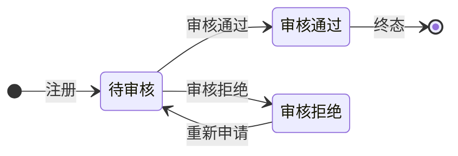

# 账号与认证体系 功能需求规格说明书

## 文档信息

- 基线 Feature：无
- 变更组：无

---

# 功能需求规格说明书

## 1. 概述

### 1.1 功能背景

账号与认证体系是系统的入口模块，为多店铺积分商城系统提供完整的账号注册、登录、用户管理能力。通过邀请码机制实现角色自动划分：管理员生成的邀请码用于注册店铺用户，店铺用户生成的邀请码用于注册普通用户。

### 1.2 本功能业务目标

1. **统一认证入口**：提供用户名+密码登录方式
2. **邀请码注册机制**：通过邀请码自动判断注册账号角色类型
3. **账号审核流程**：新账号需审核通过才能登录
4. **统一用户管理**：管理员和店铺用户分别管理不同范围的用户
5. **个人中心**：支持修改个人信息、密码、生成邀请码

---

## 2. 角色与权限矩阵

> **说明**：本章节整合所有权限信息，是权限控制的**单一真实来源**。第4章各页面的权限要求均引用本章节，避免重复定义。

### 2.1 数据权限（行级访问控制）

| 角色 | 数据范围 | 说明 |
|------|---------|------|
| 平台管理员 | 全部用户 | 可查看/编辑/重置所有店铺用户和普通用户 |
| 店铺用户 | 本店普通用户 | 可查看/编辑/调整积分/重置本店普通用户 |
| 普通用户 | 仅自己 | 只能查看和操作自己的账号信息 |

### 2.2 页面访问权限

| 页面名称 | 可访问角色 | 可操作角色 | 字段级权限 |
|---------|----------|----------|-----------|
| 登录页 | 所有角色（公开） | - | 无 |
| 注册页 | 所有角色（公开） | - | 无 |
| 管理员用户管理 | 平台管理员 | 平台管理员 | 无 |
| 店铺用户管理 | 店铺用户 | 店铺用户 | 无 |
| 个人中心 | 所有登录用户 | 所有登录用户 | 只能操作自己的信息 |

---

## 3. 页面与功能总览

### 3.1 页面清单

| 序号 | 页面名称 | 页面形式 | 职责说明 | 包含功能 |
|-----|---------|---------|---------|---------|
| 1 | 登录页 | 独立页面 | 用户登录入口 | 用户名密码登录、错误提示 |
| 2 | 注册页 | 独立页面 | 新用户注册 | 填写信息、邀请码校验 |
| 3 | 管理员用户管理 | 独立页面 | 管理所有店铺用户和普通用户 | 列表查看、编辑、重置密码 |
| 4 | 店铺用户管理 | 独立页面 | 管理本店普通用户 | 列表查看、新增、导入、编辑、调整积分、积分流水、重置密码 |
| 5 | 个人中心 | 独立页面 | 管理个人信息 | 修改昵称、修改密码、生成邀请码 |

### 3.2 页面跳转流程

```
[登录页] → 登录成功 → [管理员] → [管理员用户管理] / [个人中心]
                         → [店铺用户] → [店铺用户管理] / [个人中心]
                         → [普通用户] → [个人中心]

[登录页] → 注册入口 → [注册页] → 注册成功 → [登录页]

[个人中心] → 生成邀请码 → [复制邀请码]
```

---

## 4. 页面功能详细说明

### 按钮级别说明（通用）

| 级别 | 位置 | 作用域 | 示例 |
|-----|-----|-------|------|
| **页面级按钮** | 页面顶部工具栏 | 针对整个页面或全局操作 | 新增、导入、刷新 |
| **行级按钮** | 列表/表格的每行操作列 | 针对单条数据记录 | 编辑、删除、重置密码、调整积分 |
| **字段级按钮** | 字段右侧或内部 | 针对单个字段的辅助操作 | 复制邀请码 |

---

### 4.1 页面1：登录页

#### 4.1.1 页面概述

**页面形式：** 独立页面（公开，无需登录即可访问）

**页面职责：** 用户输入用户名和密码进行身份认证，是系统统一登录入口。

#### 4.1.2 涉及字段

**登录表单字段：**

| 字段名称 | 字段类型 | 数据来源 | 校验规则 | 默认值 | 业务含义 |
|---------|---------|---------|---------|--------|--------|
| 用户名 | 文本 | 用户输入 | 必填，4-20字符 | 空 | 账号唯一标识 |
| 密码 | 密码 | 用户输入 | 必填，6-20字符 | 空 | 登录凭证 |

#### 4.1.3 功能与按钮

**用户可操作功能：**

- **登录**
  - 触发按钮：登录按钮
  - 按钮级别：页面级
  - 按钮位置：表单底部
  - 触发方式：点击按钮
  - 权限要求：公开
  - 加载状态：点击后显示loading，禁止重复提交
  - 功能说明：验证用户名密码，验证通过后根据账号角色跳转到对应首页，验证失败提示"用户名或密码错误"

- **跳转注册**
  - 触发按钮：注册入口链接
  - 按钮级别：页面级
  - 按钮位置：表单底部
  - 触发方式：点击链接
  - 权限要求：公开
  - 加载状态：无
  - 功能说明：跳转到注册页面

#### 4.1.4 业务规则

- **规则1：账号状态校验**
  - 规则描述：账号状态为"待审核"时，登录失败并提示"账号正在审核中，请等待"
  - 触发条件：登录验证通过后，检查账号状态
  - 约束说明：仅审核通过的账号可登录

- **规则2：密码错误次数限制**
  - 规则描述：连续5次密码错误，账号锁定30分钟
  - 触发条件：密码错误累计达到5次
  - 约束说明：锁定期间不能登录

#### 4.1.5 交互逻辑

- **交互1：密码显示切换**
  - 点击眼睛图标切换密码显示/隐藏
- **交互2：错误提示**
  - 登录失败时，在用户名输入框下方显示错误信息
- **交互3：自动跳转**
  - 登录成功1秒后自动跳转到对应角色首页

#### 4.1.6 权限要求

> **参见第2.2节"页面访问权限"**，本页面的可访问角色、可操作角色均以第2章定义为准。

---

### 4.2 页面2：注册页

#### 4.2.1 页面概述

**页面形式：** 独立页面（公开，无需登录即可访问）

**页面职责：** 新用户通过邀请码注册账号，系统根据邀请码类型自动判断账号角色。

#### 4.2.2 涉及字段

**注册表单字段：**

| 字段名称 | 字段类型 | 数据来源 | 校验规则 | 默认值 | 业务含义 |
|---------|---------|---------|---------|--------|--------|
| 昵称 | 文本 | 用户输入 | 必填，2-20字符 | 空 | 显示名称 |
| 用户名 | 文本 | 用户输入 | 必填，4-20字符，字母开头，字母数字下划线 | 空 | 登录账号，唯一 |
| 邀请码 | 文本 | 用户输入 | 必填，8位字母数字 | 空 | 判断注册角色类型 |
| 密码 | 密码 | 用户输入 | 必填，6-20字符 | 空 | 登录凭证 |
| 确认密码 | 密码 | 用户输入 | 必填，必须与密码相同 | 空 | 确认密码 |

#### 4.2.3 功能与按钮

**用户可操作功能：**

- **注册**
  - 触发按钮：注册按钮
  - 按钮级别：页面级
  - 按钮位置：表单底部
  - 触发方式：点击按钮
  - 权限要求：公开
  - 加载状态：点击后显示loading
  - 功能说明：校验表单数据，验证邀请码有效后创建账号，账号状态默认为"待审核"

- **跳转登录**
  - 触发按钮：登录入口链接
  - 按钮级别：页面级
  - 按钮位置：表单底部
  - 触发方式：点击链接
  - 权限要求：公开
  - 加载状态：无
  - 功能说明：跳转到登录页面

#### 4.2.4 业务规则

- **规则1：邀请码角色判断**
  - 规则描述：
    - 管理员生成的邀请码 → 注册账号为"店铺用户"
    - 店铺用户生成的邀请码 → 注册账号为"普通用户"
  - 触发条件：注册时填写邀请码
  - 约束说明：根据邀请码来源自动判断注册角色

- **规则2：邀请码有效性**
  - 规则描述：邀请码必须有效且未被使用，使用后失效
  - 触发条件：提交注册表单
  - 约束说明：无效邀请码提示"邀请码无效"

- **规则3：用户名唯一性**
  - 规则描述：用户名全局唯一，不能重复
  - 触发条件：填写用户名时实时校验
  - 约束说明：重复提示"用户名已存在"

#### 4.2.5 交互逻辑

- **交互1：密码强度提示**
  - 密码输入时显示强度指示（弱/中/强）
- **交互2：确认密码实时校验**
  - 确认密码输入时实时比对，不相同显示提示
- **交互3：注册成功跳转**
  - 注册成功后跳转到登录页，提示"注册成功，请等待审核"

#### 4.2.6 权限要求

> **参见第2.2节"页面访问权限"**，本页面的可访问角色、可操作角色均以第2章定义为准。

---

### 4.3 页面3：管理员用户管理

#### 4.3.1 页面概述

**页面形式：** 独立页面

**页面职责：** 平台管理员管理所有店铺用户和普通用户，可查看所有用户列表、编辑用户信息、重置密码。

#### 4.3.2 涉及字段

##### A. 查询字段（列表页专用）

| 字段名称 | 字段类型 | 数据来源 | 校验规则 | 默认值 | 业务含义 |
|---------|---------|---------|---------|--------|--------|
| 搜索关键词 | 文本 | 用户输入 | 支持模糊匹配 | 空 | 搜索用户名/昵称 |
| 角色筛选 | 下拉单选 | 用户输入 | 全部/店铺用户/普通用户 | 全部 | 按角色筛选 |

##### B. 显示字段

| 字段名称 | 字段类型 | 数据来源 | 获取时机 | 校验规则 | 默认值 | 业务含义 |
|---------|---------|---------|---------|---------|--------|--------|
| 昵称 | 文本 | 数据库查询 | 页面加载 | 无 | 用户显示名称 |
| 用户名 | 文本 | 数据库查询 | 页面加载 | 无 | 登录账号 |
| 角色 | 文本/标签 | 数据库查询 | 页面加载 | 无 | 店铺用户/普通用户 |
| 状态 | 文本/标签 | 数据库查询 | 页面加载 | 无 | 待审核/审核通过/审核拒绝 |
| 所属店铺 | 文本 | 数据库查询 | 页面加载 | 无 | 用户所属店铺名称 |
| 创建时间 | 日期时间 | 数据库查询 | 页面加载 | 无 | 账号创建时间 |

#### 4.3.3 功能与按钮

**用户可操作功能：**

- **刷新**
  - 触发按钮：刷新按钮
  - 按钮级别：页面级
  - 按钮位置：列表顶部工具栏
  - 触发方式：点击按钮
  - 权限要求：仅平台管理员
  - 加载状态：显示loading
  - 功能说明：重新加载用户列表数据

- **搜索**
  - 触发按钮：搜索按钮
  - 按钮级别：页面级
  - 按钮位置：搜索框右侧
  - 触发方式：点击按钮/回车
  - 权限要求：仅平台管理员
  - 加载状态：显示loading
  - 功能说明：根据关键词和筛选条件查询用户

- **编辑用户**
  - 触发按钮：编辑按钮
  - 按钮级别：行级
  - 按钮位置：每行操作列
  - 触发方式：点击按钮
  - 权限要求：仅平台管理员
  - 加载状态：打开编辑弹窗
  - 功能说明：打开编辑弹窗，可修改用户昵称

- **重置密码**
  - 触发按钮：重置密码按钮
  - 按钮级别：行级
  - 按钮位置：每行操作列
  - 触发方式：点击按钮
  - 权限要求：仅平台管理员
  - 加载状态：点击后显示loading
  - 功能说明：二次确认后重置密码为随机值，弹框显示新密码

#### 4.3.4 业务规则

- **规则1：重置密码操作**
  - 规则描述：重置后生成6位随机密码，弹框显示后由管理员线下告知用户
  - 触发条件：点击重置密码按钮，二次确认
  - 约束说明：密码只显示一次

#### 4.3.5 交互逻辑

- **交互1：状态标签颜色**
  - 待审核：黄色；审核通过：绿色；审核拒绝：红色
- **交互2：空状态提示**
  - 无数据时显示"暂无用户"文案

#### 4.3.6 权限要求

> **参见第2.2节"页面访问权限"**，本页面的可访问角色、可操作角色均以第2章定义为准。

---

### 4.4 页面4：店铺用户管理

#### 4.4.1 页面概述

**页面形式：** 独立页面

**页面职责：** 店铺用户管理本店普通用户，包括查看用户列表、新增用户、批量导入、编辑信息、调整积分、查看积分流水、重置密码。

#### 4.4.2 涉及字段

##### A. 查询字段（列表页专用）

| 字段名称 | 字段类型 | 数据来源 | 校验规则 | 默认值 | 业务含义 |
|---------|---------|---------|---------|--------|--------|
| 搜索关键词 | 文本 | 用户输入 | 支持模糊匹配 | 空 | 搜索用户名/昵称 |
| 状态筛选 | 下拉单选 | 用户输入 | 全部/待审核/审核通过/审核拒绝 | 全部 | 按状态筛选 |

##### B. 显示字段

| 字段名称 | 字段类型 | 数据来源 | 获取时机 | 校验规则 | 默认值 | 业务含义 |
|---------|---------|---------|---------|---------|--------|--------|
| 昵称 | 文本 | 数据库查询 | 页面加载 | 无 | 用户显示名称 |
| 用户名 | 文本 | 数据库查询 | 页面加载 | 无 | 登录账号 |
| 状态 | 文本/标签 | 数据库查询 | 页面加载 | 无 | 待审核/审核通过/审核拒绝 |
| 积分余额 | 数字 | 数据库查询 | 页面加载 | 无 | 用户当前积分 |
| 创建时间 | 日期时间 | 数据库查询 | 页面加载 | 无 | 账号创建时间 |

##### C. 编辑弹窗字段

| 字段名称 | 字段类型 | 数据来源 | 获取时机 | 校验规则 | 默认值 | 业务含义 |
|---------|---------|---------|---------|---------|--------|--------|
| 昵称 | 文本 | 用户输入/数据库回填 | 打开弹窗/用户输入 | 必填，2-20字符 | 原值 | 修改后的昵称 |

##### D. 新增用户弹窗字段

| 字段名称 | 字段类型 | 数据来源 | 获取时机 | 校验规则 | 默认值 | 业务含义 |
|---------|---------|---------|---------|---------|--------|--------|
| 昵称 | 文本 | 用户输入 | 实时输入 | 必填，2-20字符 | 空 | 新用户昵称 |
| 用户名 | 文本 | 用户输入 | 实时输入 | 必填，4-20字符，字母开头 | 空 | 新用户名（唯一） |
| 初始积分 | 数字 | 用户输入 | 实时输入 | 必填，≥0 | 0 | 初始积分 |

##### E. 调整积分弹窗字段

| 字段名称 | 字段类型 | 数据来源 | 获取时机 | 校验规则 | 默认值 | 业务含义 |
|---------|---------|---------|---------|---------|--------|--------|
| 调整方式 | 单选 | 用户输入 | 实时选择 | 必填 | 增加 | 增加或扣除 |
| 积分数量 | 数字 | 用户输入 | 实时输入 | 必填，>0 | 空 | 调整数量 |
| 操作理由 | 文本 | 用户输入 | 实时输入 | 必填，≤200字符 | 空 | 积分变动原因 |

#### 4.4.3 功能与按钮

**用户可操作功能：**

- **刷新**
  - 触发按钮：刷新按钮
  - 按钮级别：页面级
  - 按钮位置：列表顶部工具栏
  - 触发方式：点击按钮
  - 权限要求：仅店铺用户
  - 加载状态：显示loading
  - 功能说明：重新加载用户列表数据

- **搜索**
  - 触发按钮：搜索按钮
  - 按钮级别：页面级
  - 按钮位置：搜索框右侧
  - 触发方式：点击按钮/回车
  - 权限要求：仅店铺用户
  - 加载状态：显示loading
  - 功能说明：根据关键词和筛选条件查询用户

- **新增用户**
  - 触发按钮：新增按钮
  - 按钮级别：页面级
  - 按钮位置：列表顶部工具栏
  - 触发方式：点击按钮
  - 权限要求：仅店铺用户
  - 加载状态：打开新增弹窗
  - 功能说明：打开新增用户弹窗，填写信息后创建账号，账号状态默认为"审核通过"（因为是店铺用户直接创建的）

- **导入用户**
  - 触发按钮：导入按钮
  - 按钮级别：页面级
  - 按钮位置：列表顶部工具栏
  - 触发方式：点击按钮
  - 权限要求：仅店铺用户
  - 加载状态：显示loading
  - 功能说明：上传Excel文件批量创建用户

- **编辑用户**
  - 触发按钮：编辑按钮
  - 按钮级别：行级
  - 按钮位置：每行操作列
  - 触发方式：点击按钮
  - 权限要求：仅店铺用户
  - 加载状态：打开编辑弹窗
  - 功能说明：打开编辑弹窗，可修改用户昵称

- **调整积分**
  - 触发按钮：调整积分按钮
  - 按钮级别：行级
  - 按钮位置：每行操作列
  - 触发方式：点击按钮
  - 权限要求：仅店铺用户
  - 加载状态：打开调整弹窗
  - 功能说明：增加或扣除用户积分，必须填写操作理由

- **积分流水**
  - 触发按钮：积分流水按钮
  - 按钮级别：行级
  - 按钮位置：每行操作列
  - 触发方式：点击按钮
  - 权限要求：仅店铺用户
  - 加载状态：打开流水弹窗
  - 功能说明：查看该用户的积分变动记录列表

- **重置密码**
  - 触发按钮：重置密码按钮
  - 按钮级别：行级
  - 按钮位置：每行操作列
  - 触发方式：点击按钮
  - 权限要求：仅店铺用户
  - 加载状态：点击后显示loading
  - 功能说明：二次确认后重置密码为随机值，弹框显示新密码

#### 4.4.4 业务规则

- **规则1：积分扣除校验**
  - 规则描述：扣除积分时必须先检查余额是否充足，不足时阻断操作并提示"积分余额不足"
  - 触发条件：调整积分选择"扣除"时
  - 约束说明：积分余额最低为0

- **规则2：积分流水记录**
  - 规则描述：每次积分变动（增加/扣除）都记录一条流水，包括变动前余额、变动后余额、操作人、操作理由
  - 触发条件：积分调整成功时
  - 约束说明：流水记录不可删除

- **规则3：新增用户状态**
  - 规则描述：店铺用户直接创建的用户，状态默认为"审核通过"，无需审核
  - 触发条件：店铺用户点击新增用户
  - 约束说明：跳过审核流程

- **规则4：重置密码操作**
  - 规则描述：重置后生成6位随机密码，弹框显示后由店铺用户线下告知用户
  - 触发条件：点击重置密码按钮，二次确认
  - 约束说明：密码只显示一次

#### 4.4.5 交互逻辑

- **交互1：状态标签颜色**
  - 待审核：黄色；审核通过：绿色；审核拒绝：红色
- **交互2：积分余额颜色**
  - 积分为0显示灰色；>0显示正常颜色
- **交互3：导入成功提示**
  - 导入完成后显示成功数量和失败数量

#### 4.4.6 权限要求

> **参见第2.2节"页面访问权限"**，本页面的可访问角色、可操作角色均以第2章定义为准。

---

### 4.5 页面5：个人中心

#### 4.5.1 页面概述

**页面形式：** 独立页面

**页面职责：** 所有登录用户管理自己的个人信息，包括修改昵称、修改密码、生成邀请码。

#### 4.5.2 涉及字段

##### A. 个人信息编辑字段

| 字段名称 | 字段类型 | 数据来源 | 获取时机 | 校验规则 | 默认值 | 业务含义 |
|---------|---------|---------|---------|---------|--------|--------|
| 昵称 | 文本 | 数据库查询/用户输入 | 页面加载/用户输入 | 必填，2-20字符 | 原昵称 | 修改后的昵称 |

##### B. 修改密码字段

| 字段名称 | 字段类型 | 数据来源 | 获取时机 | 校验规则 | 默认值 | 业务含义 |
|---------|---------|---------|---------|---------|--------|--------|
| 当前密码 | 密码 | 用户输入 | 用户输入 | 必填 | 空 | 验证身份 |
| 新密码 | 密码 | 用户输入 | 用户输入 | 必填，6-20字符 | 空 | 新密码 |
| 确认密码 | 密码 | 用户输入 | 用户输入 | 必填，必须与新密码相同 | 空 | 确认新密码 |

##### C. 邀请码字段（只读）

| 字段名称 | 字段类型 | 数据来源 | 获取时机 | 校验规则 | 默认值 | 业务含义 |
|---------|---------|---------|---------|---------|--------|--------|
| 我的邀请码 | 文本 | 数据库查询 | 页面加载 | 无 | 无/已生成 | 当前有效邀请码 |
| 邀请码类型 | 文本 | 数据库查询 | 页面加载 | 无 | 对应角色 | 管理员/店铺用户 |

#### 4.5.3 功能与按钮

**用户可操作功能：**

- **保存昵称**
  - 触发按钮：保存昵称按钮
  - 按钮级别：页面级
  - 按钮位置：昵称编辑区域
  - 触发方式：点击按钮
  - 权限要求：所有登录用户
  - 加载状态：显示loading
  - 功能说明：保存修改后的昵称

- **保存密码**
  - 触发按钮：保存密码按钮
  - 按钮级别：页面级
  - 按钮位置：密码修改区域
  - 触发方式：点击按钮
  - 权限要求：所有登录用户
  - 加载状态：显示loading
  - 功能说明：验证当前密码后修改为新密码

- **生成邀请码**
  - 触发按钮：生成邀请码按钮
  - 按钮级别：页面级
  - 按钮位置：邀请码展示区域
  - 触发方式：点击按钮
  - 权限要求：平台管理员/店铺用户
  - 加载状态：显示loading
  - 功能说明：
    - 店铺用户：生成普通用户邀请码
    - 平台管理员：生成店铺用户邀请码
    - 生成后显示在页面上

- **重新生成邀请码**
  - 触发按钮：重新生成按钮
  - 按钮级别：页面级
  - 按钮位置：邀请码展示区域
  - 触发方式：点击按钮
  - 权限要求：平台管理员/店铺用户
  - 加载状态：显示loading
  - 功能说明：二次确认后生成新的邀请码，旧码立即失效

- **复制邀请码**
  - 触发按钮：复制按钮
  - 按钮级别：字段级
  - 按钮位置：邀请码输入框右侧
  - 触发方式：点击按钮
  - 权限要求：平台管理员/店铺用户
  - 加载状态：无
  - 功能说明：一键复制邀请码到剪贴板，提示"复制成功"

#### 4.5.4 业务规则

- **规则1：邀请码永久有效**
  - 规则描述：邀请码生成后永久有效，直到被重新生成
  - 触发条件：生成邀请码后
  - 约束说明：重新生成后旧码立即失效

- **规则2：邀请码唯一性**
  - 规则描述：每个用户同时只有一个有效邀请码
  - 触发条件：重新生成时
  - 约束说明：新码生成后旧码立即失效

- **规则3：当前密码校验**
  - 规则描述：修改密码前必须验证当前密码正确
  - 触发条件：点击保存密码
  - 约束说明：当前密码错误时拒绝修改

#### 4.5.5 交互逻辑

- **交互1：密码强度提示**
  - 新密码输入时显示强度指示（弱/中/强）
- **交互2：复制成功提示**
  - 复制成功显示Toast提示"邀请码已复制"
- **交互3：重新生成确认**
  - 点击重新生成时显示确认弹窗，说明"重新生成后旧码将立即失效"

#### 4.5.6 权限要求

> **参见第2.2节"页面访问权限"**，本页面的可访问角色、可操作角色均以第2章定义为准。

---

## 5. 非页面功能详细说明

### 5.1 账号注册接口

#### 5.1.1 功能概述

**触发方式：** API接口调用
**触发时机：** 用户提交注册表单
**功能职责：** 创建新账号，根据邀请码判断账号角色，状态默认为待审核

#### 5.1.2 处理流程

1. 接收注册请求（昵称、用户名、邀请码、密码）
2. 校验用户名唯一性
3. 校验邀请码有效性（存在、未使用）
4. 根据邀请码来源确定账号角色
5. 创建账号记录（状态=待审核）
6. 标记邀请码已使用
7. 返回注册成功

#### 5.1.3 涉及数据

| 数据项 | 数据来源 | 数据用途 | 说明 |
|-------|---------|---------|------|
| 昵称 | 用户输入 | 显示名称 | 注册时填写 |
| 用户名 | 用户输入 | 登录账号 | 全局唯一 |
| 邀请码 | 用户输入 | 角色判断 | 关联生成者 |
| 密码 | 用户输入 | 登录凭证 | 加密存储 |
| 角色 | 系统判断 | 账号类型 | 根据邀请码来源 |
| 状态 | 系统预设 | 账号状态 | 默认为待审核 |

#### 5.1.4 业务规则

- **规则1：邀请码来源角色判断**
  - 管理员邀请码 → 注册店铺用户
  - 店铺用户邀请码 → 注册普通用户

#### 5.1.5 异常处理

| 异常场景 | 处理方式 | 错误提示/日志 |
|---------|---------|--------------|
| 用户名已存在 | 拒绝注册 | 返回"用户名已存在" |
| 邀请码无效 | 拒绝注册 | 返回"邀请码无效" |
| 邀请码已使用 | 拒绝注册 | 返回"邀请码已使用" |

---

### 5.2 账号登录接口

#### 5.2.1 功能概述

**触发方式：** API接口调用
**触发时机：** 用户提交登录表单
**功能职责：** 验证用户凭证，返回登录凭证（Token）

#### 5.2.2 处理流程

1. 接收登录请求（用户名、密码）
2. 校验账号存在性
3. 校验密码正确性
4. 校验账号状态（仅审核通过可登录）
5. 记录登录日志
6. 生成Token返回

#### 5.2.3 异常处理

| 异常场景 | 处理方式 | 错误提示/日志 |
|---------|---------|--------------|
| 用户名不存在 | 拒绝登录 | 返回"用户名或密码错误" |
| 密码错误 | 拒绝登录 | 返回"用户名或密码错误"，累计错误次数 |
| 账号待审核 | 拒绝登录 | 返回"账号正在审核中，请等待" |
| 账号审核拒绝 | 拒绝登录 | 返回"账号审核被拒绝" |
| 账号已冻结 | 拒绝登录 | 返回"账号已冻结" |

---

## 6. 数据状态定义

### 6.1 账号状态

| 状态名称 | 状态说明 | 可转换到的状态 |
|---------|---------|--------------|
| 待审核 | 新注册账号，等待管理员审核 | 审核通过、审核拒绝 |
| 审核通过 | 审核通过，可正常登录使用 | 无（终态） |
| 审核拒绝 | 审核未通过，不可登录 | 待审核（重新申请） |

### 6.2 状态转换规则

| 当前状态 | 可转换到的状态 | 转换条件 | 转换触发方式 |
|---------|------------|---------|-------------|
| 待审核 | 审核通过 | 管理员审核通过 | 用户操作（管理员审核） |
| 待审核 | 审核拒绝 | 管理员审核拒绝 | 用户操作（管理员审核） |
| 审核拒绝 | 待审核 | 用户重新提交注册申请 | 用户操作（重新注册） |

### 6.3 账号状态图



---

## 7. 集成和依赖

### 7.1 外部系统集成

| 系统名称 | 集成方式 | 集成内容 | 调用时机 | 依赖功能 |
|---------|---------|---------|---------|---------|
| 无 | - | - | - | - |

### 7.2 内部功能依赖

| 当前功能 | 依赖的功能 | 依赖说明 | 依赖类型 |
|---------|-----------|---------|---------|
| 账号注册 | 系统基础设施 | 数据隔离框架 | 数据依赖 |
| 账号登录 | 系统基础设施 | 数据隔离框架 | 数据依赖 |
| 用户管理 | 系统基础设施 | 数据隔离框架 | 数据依赖 |
| 文件上传 | 系统基础设施 | 文件存储服务 | 文件存储依赖 |

---

## 8. 附录

### 8.1 术语表

| 术语 | 定义 | 说明 |
|------|------|------|
| 邀请码 | 用于注册新账号的凭证 | 区分角色：管理员生成→店铺用户，店铺用户生成→普通用户 |
| 平台管理员 | 系统超级管理员 | 初始化时内置，可管理所有店铺用户和普通用户 |
| 店铺用户 | 每个店铺的管理员账号 | 管理本店普通用户，可生成普通用户邀请码 |
| 普通用户 | 店铺的消费者 | 通过店铺用户生成的邀请码注册 |

### 8.2 参考文档

| 文档名称 | 类型 | 来源 | 用途 | 说明 |
|---------|------|------|------|------|
| PRD | 产品需求文档 | /context/02_prd/PRD.md | 功能背景参考 | 账号注册审核流程说明 |
| 业务需求 | 需求文档 | /context/01_需求澄清/00_业务需求.md | 数据隔离规则参考 | 角色数据权限 |

### 8.3 变更记录

| 版本 | 日期 | 变更内容 | 变更人 |
|------|------|---------|--------|
| v1.0 | 2026-04-28 | 初始版本 | daydream |
